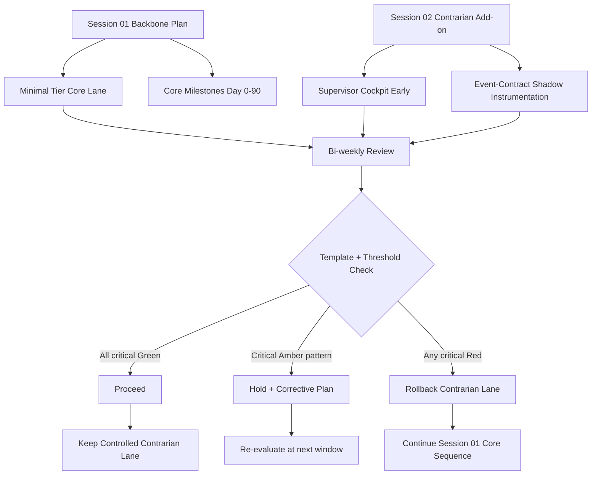

# Combined Strategy Visual + Template Check

## Scope

This view combines:
- Session 01 backbone plan
- Session 02 contrarian lane additions
- Session 03 threshold governance

References:
- [2026-03-28-session-01-orchestrator-synthesis.md](2026-03-28-session-01-orchestrator-synthesis.md)
- [2026-03-28-session-02-contrarian-synthesis.md](2026-03-28-session-02-contrarian-synthesis.md)
- [2026-03-28-session-03-quantified-thresholds.md](2026-03-28-session-03-quantified-thresholds.md)
- [../templates/decision-dashboard-template.md](../templates/decision-dashboard-template.md)

## Visual Model

## Template Alignment Matrix

| Combined element | Template section | How to evaluate |
|---|---|---|
| Core lane (Session 01) | Overall Decision, Gate Checklist | Baseline execution confidence and non-breaking behavior |
| Supervisor cockpit early | Metric Board, Day 45/60/90 Gates | Supervisor Active Usage, Lead-Time Improvement, Reporting Accuracy |
| Event-contract shadow mode | Metric Board, Composite Logic Check | Audit Reconstruction, Compatibility Pass Rate, Cognitive Load |
| Switch-back policy | Overall Decision, Composite Logic Check | Any critical Red triggers Rollback |
| Deferred decision handling | Decision Notes, Risk And Action Register | Confirm no forced commitment without evidence |

## Pre-Filled Template Check (Current State)

### Overall Decision
- State: Proceed (controlled)
- Rationale: Session 01 remains primary; Session 02 lane is bounded by Session 03 thresholds.
- Immediate actions:
  - Run first bi-weekly dashboard fill.
  - Record Day 45 values for critical metrics.

### Metric Board Status Baseline (Before measurement)

| Metric | Status now | Comment |
|---|---|---|
| Audit Reconstruction Success Rate | Pending | Instrumentation required to measure |
| Compatibility Non-Breaking Pass Rate | Pending | Compatibility suite must be active |
| Expected-vs-Actual Reporting Accuracy | Pending | Needs supervisory report reconciliation samples |
| Delivery Predictability | Pending | Needs sprint commitment tracking |
| Guardrail Breach Count | Pending | Needs governance log owner |
| Supervisor Active Usage | Pending | Needs usage telemetry for cockpit |
| Intervention Lead-Time Improvement | Pending | Needs baseline and current cycle timestamps |
| Team Cognitive Load Index | Pending | Needs pulse + interruption tracking inputs |

### Gate Readiness

| Gate | Ready to evaluate? | Missing input |
|---|---|---|
| Day 45 | Partially | Metric collection pipelines and owners |
| Day 60 | No | Day 45 baseline and trend history |
| Day 90 | No | Day 60 pass plus usage improvement evidence |

## Immediate Next Steps

1. Assign metric owners in dashboard header for all 8 metrics.
2. Complete first dashboard fill using [../templates/decision-dashboard-template.md](../templates/decision-dashboard-template.md).
3. Run first formal decision state (Proceed/Hold/Rollback) using composite logic.
